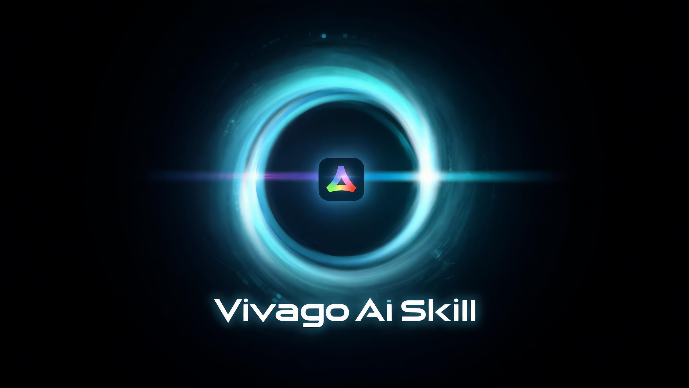

# Vivago AI Skill

<p align="center">
  
</p>

AI image and video generation using Vivago AI (智小象) platform.

[](https://github.com/ZhaofanQiu/vivago-ai-skill/actions)

## 📚 文档

- [快速开始](docs/quickstart.md) - 5分钟上手
- [API参考](docs/api_reference.md) - 完整API文档
- [架构设计](docs/architecture.md) - 系统设计
- [测试指南](docs/testing.md) - 如何测试
- [测试策略](docs/TEST_STRATEGY_OPTIMIZED.md) - 智能测试优化策略
- [故障排查](docs/troubleshooting.md) - 常见问题
- [更新日志](CHANGELOG.md) - 版本历史

### 历史测试报告

- [测试报告 2026-03-08](docs/archive/reports/TEST_REPORT_2026_03_08.md) - 模板测试报告
- [测试报告 2026-03-07](docs/archive/reports/TEST_REPORT.md) - 完整测试报告

## 📊 功能状态

### 一级功能（大功能划分）

| 一级功能 | 状态 | 说明 |
|---------|------|------|
| 🎨 **文生图 (Text-to-Image)** | ✅ 已测试 | 支持 Kling O1 / Vivago 2.0 / Nano Banana 2 |
| 📝 **文生视频 (Text-to-Video)** | ✅ 已测试 | 支持 v3L(快) / v3Pro(质) / Kling video O1 |
| 🎬 **图生视频 (Image-to-Video)** | ✅ 已测试 | 支持 v3L / v3Pro / Kling video O1 |
| 🔄 **图生图 (Image-to-Image)** | ✅ 已测试 | 支持 Kling O1(快) / Nano Banana 2(质)，多图融合 |
| 🎞️ **视频首尾帧 (Keyframe-to-Video)** | ✅ 已测试 | 支持 v3L / v3Pro |
| 🎭 **视频模板 (Template-to-Video)** | ✅ 已测试 | 支持 **181** 个模板效果，40个验证通过 |
| ⬆️ **图像上传 (Image Upload)** | ✅ 已实现 | 支持自动压缩 |

### 二级端口（具体API端点）

详见 [docs/api_reference.md](docs/api_reference.md)

---

## 🏗️ 架构设计

### 代码质量改进

本项目已完成全面代码审查和重构（P0-P3）：

| 改进项 | 状态 | 说明 |
|--------|------|------|
| **CI/CD** | ✅ | GitHub Actions 自动化测试 |
| **类型安全** | ✅ | 完整的枚举和类型注解 |
| **异常处理** | ✅ | 结构化异常层次 |
| **模块化配置** | ✅ | 分体式配置文件 |
| **依赖锁定** | ✅ | 固定版本确保可复现构建 |

### 核心模块

```
scripts/
├── __init__.py              # 包导出
├── vivago_client.py         # 核心客户端
├── template_manager.py      # 模板管理器
├── config_loader.py         # 配置加载器
├── enums.py                 # 类型枚举
├── exceptions.py            # 异常类
├── logging_config.py        # 日志配置
└── config/                  # 模块化配置
    ├── base.json
    ├── text_to_image.json
    ├── image_to_video.json
    └── ...
```

---

## 🚀 快速开始

### 1. 安装依赖

```bash
pip install -r requirements.txt
```

### 2. 获取 API Token

在使用本项目之前，您需要获取 Vivago.ai 的 API Token：

#### 步骤 1: 登录 Vivago.ai
1. 访问 [https://vivago.ai/](https://vivago.ai/) 并登录您的账号
2. 检查剩余积分，根据需要选择合适的订阅套餐

#### 步骤 2: 获取 Token
1. 登录后，访问 [https://vivago.ai/prod-api/user/token](https://vivago.ai/prod-api/user/token)
2. 页面将返回您的 API Token（格式为 JWT 字符串）
3. 复制该 Token 用于后续配置

> **提示**: Token 是访问 API 的凭证，请妥善保管，不要泄露给他人。

### 3. 配置环境变量

获取 Token 后，设置环境变量：

```bash
export HIDREAM_TOKEN="your_vivago_api_token"
```

> **Note:** `STORAGE_AK` and `STORAGE_SK` are no longer required. The new image upload method uses pre-signed URLs instead of direct S3 access.


### 3. 使用示例

```python
from scripts import create_client, VivagoClient
from scripts.enums import AspectRatio, PortName
from scripts.exceptions import TaskFailedError

client = create_client()

# 文生图
results = client.text_to_image(
    prompt="一只可爱的小熊猫",
    port=PortName.KLING_IMAGE,
    wh_ratio=AspectRatio.RATIO_1_1
)
```

---

## 🧪 测试

```bash
# 运行单元测试
pytest tests/ -v

# 查看测试推荐
python tests/smart_test_optimizer.py
```

---

## 📁 项目结构

```
vivago-ai-skill/
├── scripts/                 # 核心代码
│   ├── vivago_client.py
│   ├── template_manager.py
│   ├── config_loader.py
│   ├── enums.py
│   ├── exceptions.py
│   └── config/             # 模块化配置
├── tests/                   # 测试代码
│   ├── conftest.py         # Pytest配置
│   ├── archive/            # 归档测试
│   └── ...
├── docs/                    # 文档
├── .github/workflows/       # CI配置
├── requirements.txt
├── README.md
└── CHANGELOG.md
```

---

## 📝 更新日志

### v0.9.0 (2026-03-09) - Code Review Complete
- ✅ 完成全面代码审查 (P0-P3)
- ✅ 添加 GitHub Actions CI
- ✅ 新增类型安全模块 (enums.py)
- ✅ 新增结构化异常处理 (exceptions.py)
- ✅ 拆分配置文件为模块化结构
- ✅ 归档冗余代码和测试文件
- ✅ 锁定依赖版本确保可复现构建

### v0.8.2 (2026-03-08)
- ✅ 大规模模板测试：44 个模板，40 个通过 (90.9%)

### v0.8.0 (2026-03-07)
- ✅ 完成 Tier 1-4 完整测试
- ✅ 建立智能测试优化系统

---

*最后更新: 2026-03-09*  
*版本: v0.9.0*
